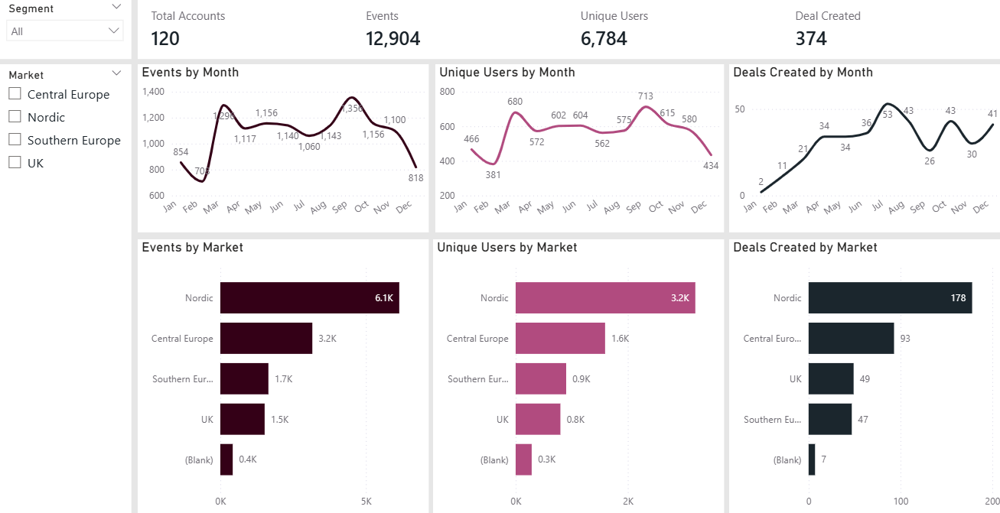
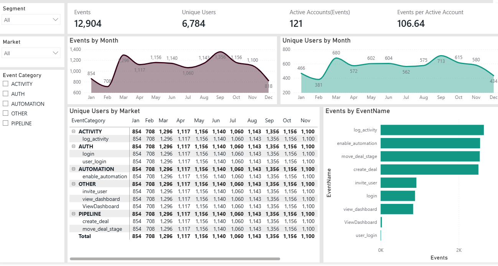

# Product Analytics Dashboard

A **Product Analytics dashboard** built with **Power BI** that integrates **SQL-cleaned data (DuckDB)** and **DAX time-intelligence metrics** to analyze **user activation, product adoption, engagement trends, and market-level events**. Designed to support **data-driven product and growth decisions**.

---

## Table of Contents
- [About the Project](#about-the-project)
- [Features](#features)
- [Technologies Used](#technologies-used)
- [Screenshot ](#screenshot)

---

## About the Project

This Product Analytics dashboard helps teams understand how users interact with a product across the lifecycle — from **account creation and activation** to **adoption and engagement**.

The project combines **SQL-based data cleaning**, **interactive Power BI dashboards**,**Data Modeling** and **DAX** to deliver actionable insights into product performance and user behavior.

---

## 🚀 Features

- **Clean & Structured Product Data** using SQL  for reliable analytics  
- **DAX Time Intelligence** to analyze activation, adoption, and engagement trends  
- **Account Activation & Time-to-Value Metrics** for funnel and conversion analysis  
- **Product Usage & Engagement Analysis** using rolling 7/14/30-day windows  
- **Interactive Power BI Dashboard** with filters and KPI monitoring  

---

## Technologies Used

- **DuckDB** – Database Management System 
- **DBeaver** – Database Visualisation
- **Power BI** – Dashboard development and product analytics visualization  
- **DAX** – Time-intelligence calculations and KPI metrics
- **VS Code** – Development environment for SQL scripts
---

## Screenshot

---

## Key Insights

- Identified activation drop-offs and engagement trends using rolling time windows  
- Analyzed product adoption patterns across users and time periods  
- Monitored active vs inactive accounts to assess product health  
---

## Author

**Fathima Safa**  
 Data Analyst

